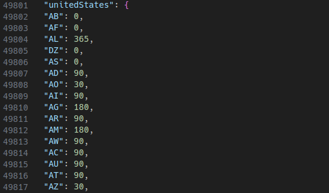

<p align="center">
<a href="LICENSE.md"></a>
<a></a>
<a></a>
<a></a>
</p>

<p align="center">
<a></a>
<a></a>
</p>

# Website

https://visamap.co

# Contribute

## public/visaPolicy.json

Visa-map uses the public/visaPolicy.json file to fetch the corresponding visa policy information for each country.


### Format:

```
"passport": {
  "ISO 3166-1 alpha-2 code": number
}
```
Example: United States -> France\
United States passport holders do not need a visa to travel to france, therefore visa-free (7) is the corresponding number.
```
"unitedStates": {
  "FR": 7
}
```

To contribute, simply navigate to the passport, ISO code, and change the number.\
Example: France now requires United States passport holders to get a visa. 
```
"unitedStates": {
  "FR": 7
}

      |
      v

"unitedStates": {
  "FR": 15
}
```

### Corresponding numbers:

```
0: Home country (pink)
1: Permit required (red)
2: OECS freedom of movement (orange)
3: MERCSOUR freedom of movement (dark green)
4: EU freedom of movement (dark blue)
5: GCC freedom of movement (brown)
6: Freedom of movement (light pink)
7: Visa free (green)
8: Electronic Travel Authorization (mint green)
9: Visa on arrival/E-visa (light green)
10: Visa on arrival (yellow)
11: E-visa (blue)
12: Special permit/police check (purple)
13: Simplified visa (light gray)
14: Confirmation required (black)
15: Visa required (gray)
```

## public/visaDuration.json

Visa duration information is stored in a different .json file (public/visaDuration.json).



### Format:

```
"passport": {
  "ISO 3166-1 alpha-2 code": number
}
```
Example: United States -> France\
United States passport holders can stay in France for 90 days visa-free, therefore 90 is the corresponding number.
```
"unitedStates": {
  "FR": 90
}
```

Notes:

* Duration of stay is only available when the visa category is: Visa-free (7), ETA (8), Visa on arrival/E-visa (9), Visa on arrival (10), E-visa (11) or Special permit/police check (12).
* If the visa category is: Home country (0), Freedom of movement (2-6), Confirmation required (14), Visa required (15) the assigned duration of stay is 0.
* If the duration of stay is defined in years, months or weeks, it is converted into days (1 year = 365 days, 1 month = 30 days, 1 week = 7 days).
* If the duration of stay is unknown, it is set to 0 until the correct information is found.